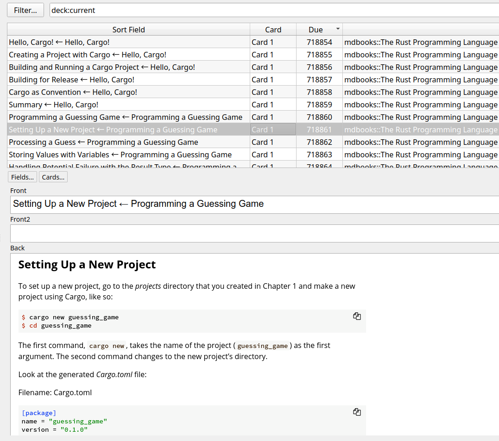

# mdbook-doc-anki-builder-with-selenium

My mini tool to make Anki decks from mdbooks using Selenium.

It's only got [App.java](src/main/java/growingspaghetti/selenium_screenshooter/App.java).

Main works are done by Selenium in docker and ImageMagick that you need to install.

Anki decks are available in the release page.



---

First, start selenium.
```
cd selenium
./docker-run.sh
```

After running that Java code, don't forget to shut it down. 
```
dockercompose down
```

I recommend nobody to build those anki decks by their own though.
